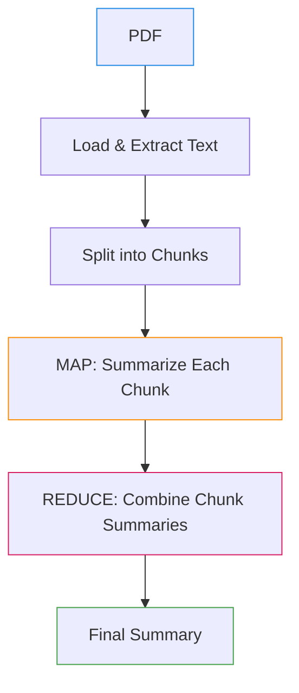
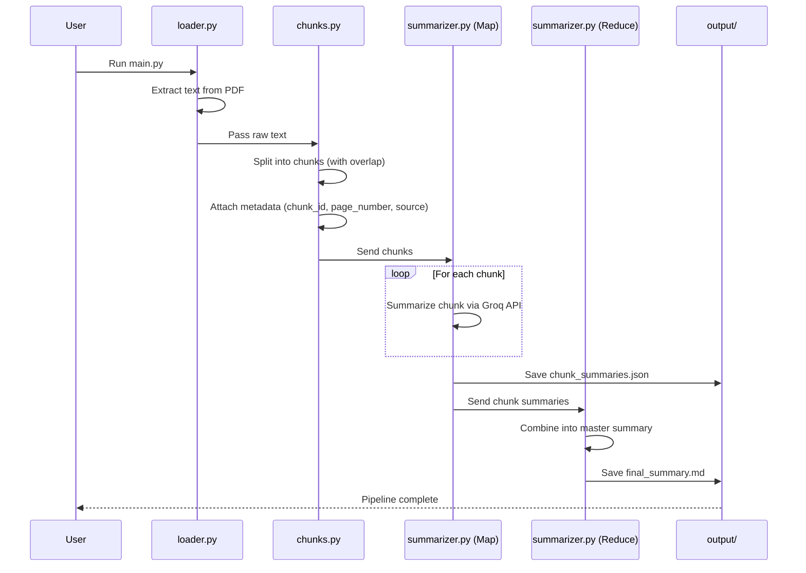
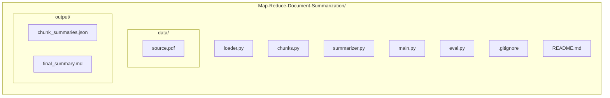

# Map-Reduce Document Summarization

A Python project that summarizes large PDF documents using the **Map-Reduce** pattern with the **Groq API**.

Large documents are split into manageable chunks, each chunk is summarized independently (**Map**), and the chunk summaries are then combined into a single cohesive summary (**Reduce**) — avoiding the need to pass an entire document into the LLM at once.

---

## How It Works



### Pipeline in Detail



---

## Features

- 📄 PDF text extraction
- ✂️ Recursive text chunking with overlap
- 🧠 Chunk-level LLM summarization
- 🏷️ Metadata preservation (`chunk_id`, `page_number`, `source`)
- 🔀 Map-Reduce summarization
- 📦 JSON output for chunk summaries
- 📝 Markdown output for the final summary
- 📊 Basic programmatic evaluation

---

## Project Structure



```text
Map-Reduce-Document-Summarization/
│
├── data/
│   └── source.pdf
├── output/
│   ├── chunk_summaries.json
│   └── final_summary.md
│
├── loader.py
├── chunks.py
├── summarizer.py
├── main.py
├── eval.py
├── .gitignore
└── README.md
```

---

## Files

| File | Responsibility |
|---|---|
| `loader.py` | Loads and extracts text from the PDF |
| `chunks.py` | Splits text into chunks and preserves metadata |
| `summarizer.py` | Implements the Map and Reduce summarization steps |
| `main.py` | Runs the complete pipeline |
| `eval.py` | Evaluates chunk and final-summary statistics |

---

## Setup

Clone the repository and install dependencies:

```bash
git clone https://github.com/PUNITH-V/Map-Reduce-Document-Summarization.git
cd Map-Reduce-Document-Summarization
pip install groq python-dotenv langchain-text-splitters
```

Create a `.env` file:

```env
GROQ_API_KEY=your_api_key_here
```

Place your PDF at:

```text
data/source.pdf
```

---

## Run

Run the complete pipeline:

```bash
python main.py
```

Evaluate the results:

```bash
python eval.py
```

---

## Output

The pipeline generates:

```text
output/
├── chunk_summaries.json
└── final_summary.md
```

- **`chunk_summaries.json`** — contains the original chunks, summaries, and metadata.
- **`final_summary.md`** — contains the final master summary produced by the Reduce step.

---

## Evaluation

`eval.py` reports:

- Total page count
- Total chunk count
- Empty chunk summaries
- Longest map-summary word count
- Final-summary word count
- Whether the final summary is under 500 words

---

## Tech Stack

- Python
- Groq API
- LangChain Text Splitters
- python-dotenv

---
